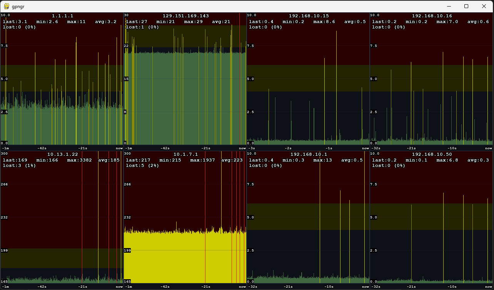

# gpngr - A cross-platform GUI Ping Grapher

A real-time ping visualization tool. Allows you to monitor multiple hosts simultaneously with live-updating graphs, customizable thresholds, and fullscreen support.

Inspired by [PingTracer](https://github.com/bp2008/pingtracer), and evolved from [pngr](https://github.com/fragtion/pngr) - offering a more detailed graphical interface instead of terminal rendering.

## Preview

## Features

- **Real-time graphing** of ping round-trip times for multiple hosts
- **Live statistics** showing last, min, max, avg, and packet loss percentage
- **Customizable thresholds** for warning and bad ping values
- **Per-host configuration** for ping rate, Y-axis scaling, and alert thresholds
- **Fullscreen support** with responsive grid layout
- **High-performance rendering** with smooth scrolling graphs
- **Cross-platform** - works on Windows, Linux, and macOS (with proper permissions)

## Differences from pngr

While [pngr](https://github.com/fragtion/pngr) focuses on terminal-based rendering for SSH/low-bandwidth environments, **gpngr** provides:

- **Graphical interface** with mouse/keyboard interaction
- **Higher resolution** rendering (full pixel-perfect graphs)
- **Color-coded zones** for warning and critical thresholds
- **Better visibility** with anti-aliased text and grid lines
- **Native window management** (resizable, fullscreen toggle)
- **No terminal bandwidth issues** - renders locally using Pygame

## Installation

### Prerequisites

- Python 3.7 or higher
- [Pygame](https://www.pygame.org/) - Install via pip or apt:  pip install pygame / apt: apt install python3-pygame

### License
MIT License. See LICENSE for details.

### Contributing
Pull requests, forks, issue and suggestion reports are all welcome.

### Coffee
Did this make you happy? I'd love to do more development like this! Please donate to show your support :)

PayPal: Donate

BTC: 1Q4QkBn2Rx4hxFBgHEwRJXYHJjtfusnYfy

XMR: 4AfeGxGR4JqDxwVGWPTZHtX5QnQ3dTzwzMWLBFvysa6FTpTbz8Juqs25XuysVfowQoSYGdMESqnvrEQ969nR9Q7mEgpA5Zm
